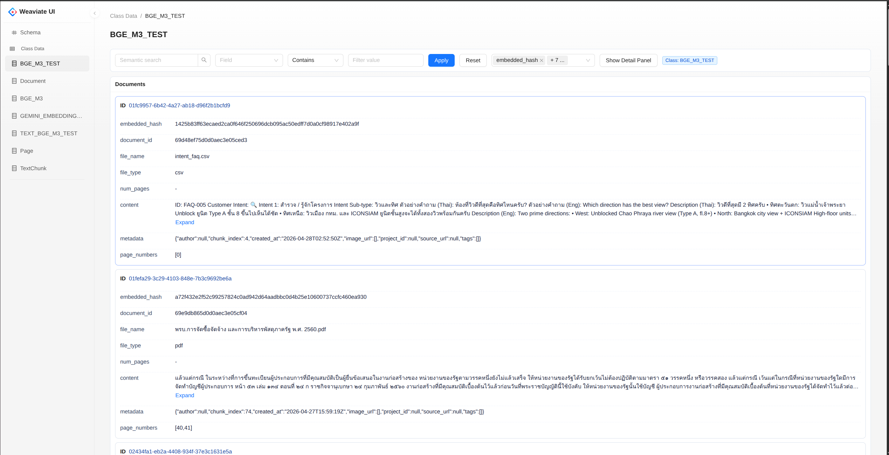

# Weaviate-UI

Weaviate-UI is a small web client and backend for exploring a Weaviate instance. It provides a React + Vite frontend and a FastAPI backend that talks to the Weaviate client.

<!-- Optional screenshot: replace `screenshot.png` if desired -->



Getting started
---------------

Prerequisites
 - Python 3.12+
 - Node.js 18+ (or pnpm/npm)
 - Docker (optional)

Run the backend (using `uv`)

```bash
uv sync
uv run uvicorn weaviate_ui.main:app --reload --host 0.0.0.0 --port 8000
```

Environment variables
- `WEAVIATE_HOST` (required): the host name or IP of your Weaviate instance, e.g. `localhost`
- `WEAVIATE_PORT` (required): the HTTP port of your Weaviate instance, e.g. `8080`
- `WEAVIATE_API_KEYS` (optional): API key for Weaviate (if your instance requires it)

Example (run backend with env vars):

```bash
WEAVIATE_HOST=localhost WEAVIATE_PORT=8080 WEAVIATE_API_KEYS=secret uv run uvicorn weaviate_ui.main:app --reload
```

Run the frontend
----------------

From the `frontend/` directory:

```bash
cd frontend
pnpm install      # or `npm install`
pnpm dev          # or `npm run dev`
```

Build frontend for production

```bash
cd frontend
pnpm build        # or `npm run build`
```

If you want the backend to serve the built frontend, copy the build output into a `static/` directory at the repo root (the FastAPI app mounts `static/` if present).

Docker
------

There is a `Dockerfile` and `compose.yml` in the repository root. You can run the published image or build locally.

Build and run locally

```bash
docker build -t weaviate-ui .
docker run -e WEAVIATE_HOST=your-weaviate -e WEAVIATE_PORT=8080 -p 7777:7777 weaviate-ui
```
